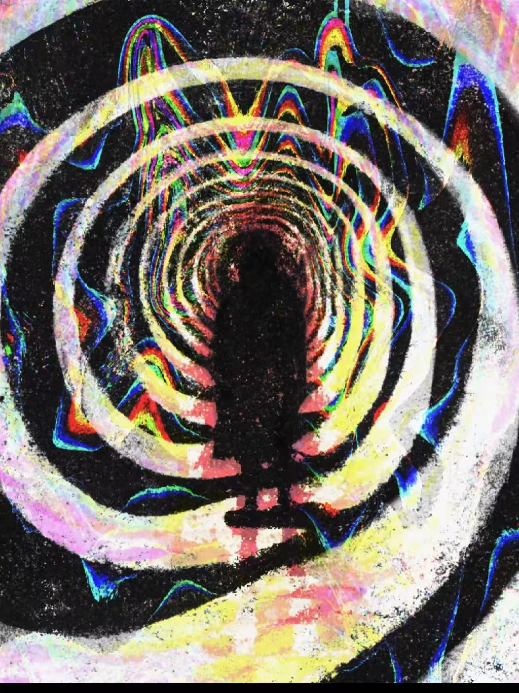
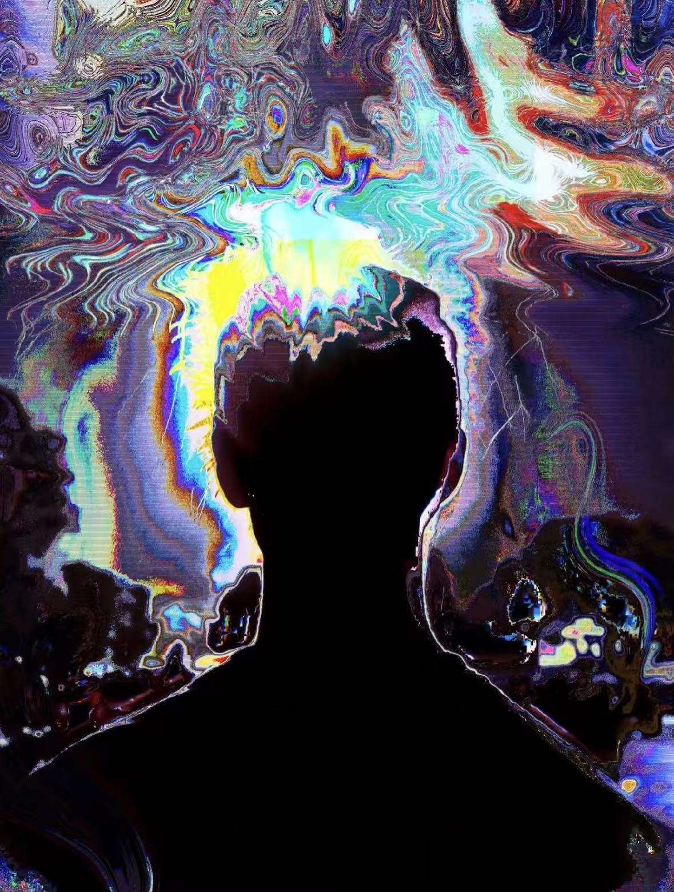
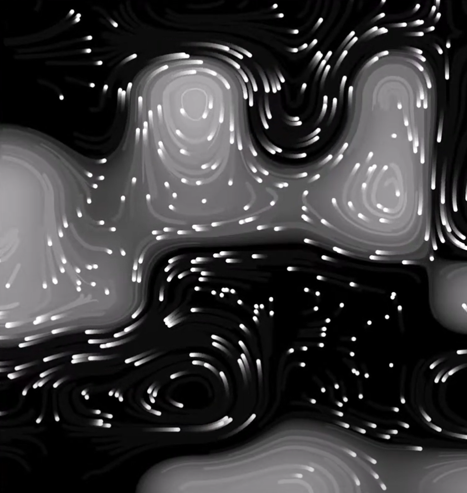
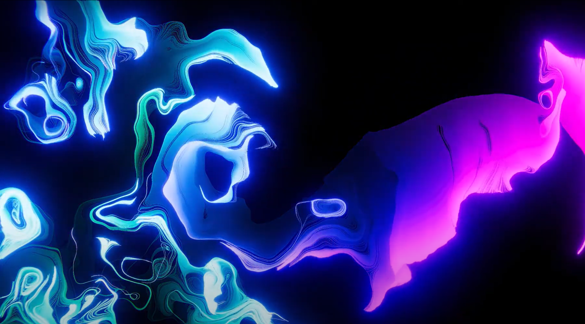

# Quiz 8 Submission

## Part 1:

My inspiration comes from the American artist Photon Tide. I am deeply attracted to the psychedelic and experimental style of his work. The wave-like patterns in these two pieces feel like brainwaves or an abstract world inside the mind, as if entering another dimension—mysterious, dreamlike, and lonely. I want to take inspiration from his art and animate these brainwave-like patterns to form a complete abstract space. These wave patterns are highly decorative and have a unique style. If I can incorporate this visual effect into my project, it will create a striking and beautiful artistic result.

## Part 2: 

By creating a simple noise image and particles, he uses the gradient vector to move the particles toward the brighter areas, achieving a swirl-like effect. Next, I will add some visual effects to the particles to create a wave-like appearance.

Learn more from the reference [here](https://www.youtube.com/watch?v=3YaTRWkpXpQ)
Learn more from the reference [here](https://editor.p5js.org/ndeji69/sketches/EA17R4HHa)